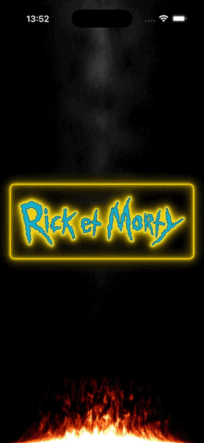

# 🚶‍♂️ Rick and Morty App

A SwiftUI-based iPhone application that displays characters from the Rick and Morty animated series, allowing users to browse, view details, and explore character information fetched from the Rick and Morty API.

## 📸 Screenshots

<div align="center">
  
  
</div>

## 🎨 Features

**Characters Grid:** Browse a grid of Rick and Morty characters with images, names, and statuses.

**Character Details:** View detailed information about each character, including species, origin, and episode appearances.

**Search and Filter:** Search characters by name or filter by status (e.g., Alive, Dead, Unknown).

**Responsive UI:** Built with SwiftUI for a smooth, modern iOS experience, supporting both light and dark modes.

**Animations:** Fluid SwiftUI animations for character previews and transitions.


## 🛠 Tech Stack

**Swift:** 5.0+

**SwiftUI:** For UI and animations

**SQLiteData:** For local data persistence

**The Composable Architecture (TCA):** For modular, testable state management

**Swift Concurrency (async/await):** For efficient network requests to the Rick and Morty API

## 🏗 Project Structure
```bash
FalloutPipBoy/
 Sources/
 ├── App/                       # Main iPhone app entry point
 │
 ├── Core/
 │    ├── Entities/             # Entities
 │    ├── Metal/                # Metal shaders
 │    ├── Models/               # Data models for characters, episodes, etc.
 │    ├── Services/             # Network (API) and database services
 │    └── Utils/                # Helpers, extensions, and utilities
 │
 ├── Features/
 │    ├── Root/                  # Main Tab View for navigation
 │    ├── About/                 # App information and credits
 │    ├── CharacterDetails/      # Detailed character view
 │    ├── CharacterPreview/      # Character preview animations
 │    ├── CharactersGrid/        # Grid view for browsing characters
 │    └── LaunchScreen/          # Custom launch screen
 │
 ├── Resources/
 │    └── Assets.xcassets       # Image assets for characters and UI
 │
 └── Tests/
      ├── UnitTests/            # Unit tests for core functionality
      └── UITests/              # UI tests for views and navigation
```
## 🚀 Installation

###Prerequisites

* Xcode 16 or later

* iOS 18 or later 

###Steps

* Clone the repository
```bash
git clone https://github.com/karkadi/RickAndMorty.git
cd RickAndMorty
```
* Open the project in Xcode:

* Launch Xcode and open RickAndMorty.xcodeproj.

* Enable required capabilities:
 - In Xcode, navigate to the project settings.
 - Enable Network Access (for API calls to the Rick and Morty API) under the Capabilities tab for the app target.

* Build and run:

Select an iPhone simulator or device as the target.
Build and run the app (Cmd + R) to install it on your device.


## 📋 Roadmap

* Implement search and filter functionality.
* Add offline caching with SQLite.
* Support light and dark mode with SwiftUI.
* Add unit tests for API and database services.
* Enhance animations for character transitions.

## 🤝 Contribution

Pull requests are welcome! For major changes, please open an issue first to discuss what you’d like to change.

## 📄 License

This project is licensed under the MIT License.
See [LICENSE](LICENSE) for details.
