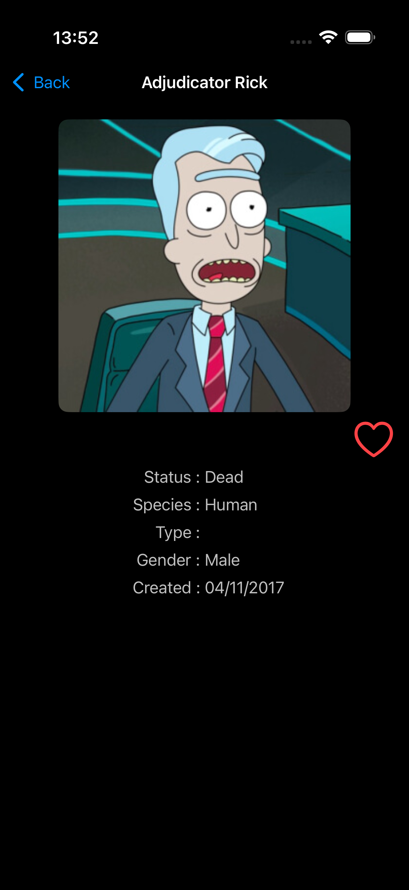

# 🚀 Rick and Morty App

A SwiftUI-based iPhone application that displays characters from the Rick and Morty animated series, allowing users to browse, view details, and explore character information fetched from the Rick and Morty API.

## 📸 Screenshots

<div align="center">
   
  
  
</div>

## 🎨 Features

**Characters Grid:** Browse a grid of Rick and Morty characters with images, names, and statuses using modern SwiftUI layouts.

**Character Details:** View detailed information about each character, including species, origin, and episode appearances with smooth transitions.

**Search and Filter:** Search characters by name or filter by status (e.g., Alive, Dead, Unknown) with real-time updates.

**Responsive UI:** Built with SwiftUI for a smooth, modern iOS experience, supporting both light and dark modes with system-adaptive interfaces.

**Animations:** Fluid SwiftUI animations for character previews and transitions powered by Swift 6's enhanced animation APIs.

## 🛠 Tech Stack

- **Swift 6.0+** - Latest Swift language features and concurrency model
- **SwiftUI** - Modern declarative UI framework with enhanced animations
- **SwiftData** - For local data persistence with Swift 6 concurrency support
- **The Composable Architecture (TCA)** - Modular, testable state management with actor isolation
- **Swift Concurrency** - Async/await, actors, and structured concurrency for network operations
- **Rick and Morty API** - REST API integration with modern async/await patterns

## 🏗 Project Structure
```bash
RickAndMorty/
 Sources/
 ├── App/                       # Main iPhone app entry point with @main
 ├── Core/
 │    ├── Entities/             # Entities with Sendable compliance
 │    ├── Metal/                # Metal shaders for advanced graphics
 │    ├── Models/               # Data models for characters, episodes with Codable
 │    ├── Services/             # Network (API) and database services with Swift 6 concurrency
 │    └── Utils/                # Helpers, extensions, and utilities
 │
 ├── Features/
 │    ├── Root/                 # Main Tab View for navigation with @MainActor
 │    ├── About/                # App information and credits
 │    ├── CharacterDetails/     # Detailed character view with async image loading
 │    ├── CharacterPreview/     # Character preview animations
 │    ├── CharactersGrid/       # Grid view for browsing characters with modern layouts
 │    └── LaunchScreen/         # Custom launch screen
 │
 ├── Resources/
 │    └── Assets.xcassets       # Image assets for characters and UI
 │
 └── Tests/
      ├── UnitTests/            # Unit tests with Swift Concurrency support
      └── UITests/              # UI tests for views and navigation
```

## 🚀 Installation

### Prerequisites

* **Xcode 16** or later (Swift 6 support required)
* **iOS 18** or later for Swift 6 compatibility
* **Swift 6 Language Mode** enabled in project settings

### Steps

1. **Clone the repository**
```bash
git clone https://github.com/karkadi/RickAndMorty.git
cd RickAndMorty
```

2. **Open the project in Xcode 16+** - The project requires Swift 6 features

3. **Enable required capabilities**:
   - Network Access for API calls to the Rick and Morty API
   - Ensure Swift 6 language mode is enabled in build settings

4. **Build and run**:
   - Select an iPhone simulator or device as the target
   - Build and run the app (Cmd + R) to install it on your device

## 🔄 Migration to Swift 6

This project has been fully migrated to Swift 6 with comprehensive concurrency support:

### Concurrency Updates:
- **@MainActor** isolation for all UI components and view models
- **Async/await** for network requests and data persistence
- **Sendable** compliance for API models and cross-actor data
- **Structured concurrency** for concurrent API calls and image loading
- **Actor isolation** for thread-safe state management in TCA


## 🎯 Swift 6 Features Utilized

- **Complete Concurrency Checking** - Strict actor isolation enforcement
- **Non-Sendable Type Safety** - Protected cross-actor data access in API services
- **Structured Task Management** - Proper cancellation for network requests
- **MainActor Integration** - Thread-safe UI updates throughout the app
- **Async Image Loading** - Modern image fetching with Swift 6 concurrency

## 📋 Roadmap

- [ ] **Swift 6 Migration Complete** ✅
- [ ] Enhanced search and filter functionality with async debouncing
- [ ] Offline caching with SwiftData and concurrency support
- [ ] Advanced light and dark mode with SwiftUI observation
- [ ] Comprehensive unit tests for API and database services with async support
- [ ] Enhanced animations for character transitions using Swift 6 animation APIs
- [ ] Widget implementation with App Intents and Swift 6

## 🐛 Known Issues

- None - Swift 6 migration completed successfully
- All concurrency warnings resolved with proper actor isolation
- Network services optimized with structured concurrency
- Data persistence modernized with SwiftData

## 🤝 Contribution

Pull requests are welcome! For major changes, please open an issue first to discuss what you'd like to change.

**Development Requirements**:
- Code must comply with Swift 6 concurrency rules
- Use @MainActor for all UI-related code
- Implement proper task cancellation for network requests
- Ensure Sendable compliance for API models and data transfer objects
- Prefer async/await over completion handlers for all asynchronous operations

## 📄 License

This project is licensed under the MIT License.
See [LICENSE](LICENSE) for details.
